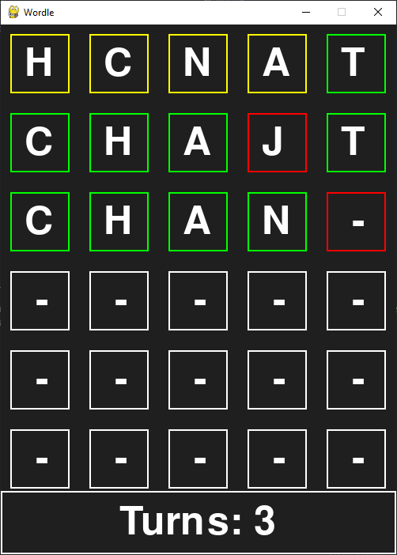

# Wordle

A simple wordle game made with pygame in python. The word is randomly chosen from a wordlist provided by an api.

# Rules
1. if you type in a correct letter at the correct place, the square will turn green.
2. if you type in a letter that is in the word but not at the right place, the square will turn yellow.
3. if you type a letter that is not in the word, the square will turn red.
4. you have 6 turns to guess the correct word and you'll win.

# How to play

To play the game, either download the zip from the release and download the packages from the `requirements.txt` file and then run the `main.py` file. Use your keyboard to type in letters. The game prints the word to the console for now so you can see it works but you can disable that if you want to actually play it.

# Exe

or if you want to just play without the code then download the `game.exe` file and run it. 

